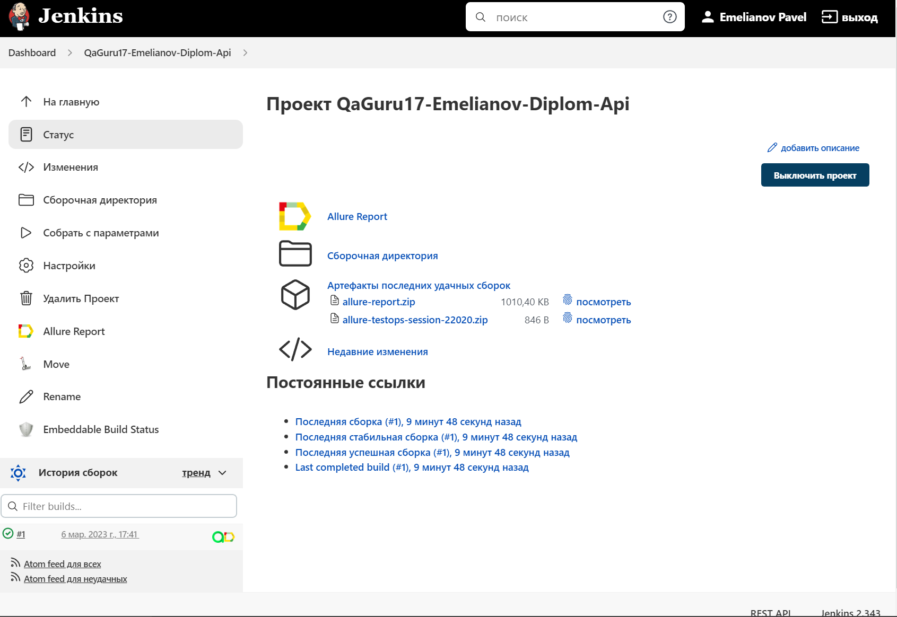
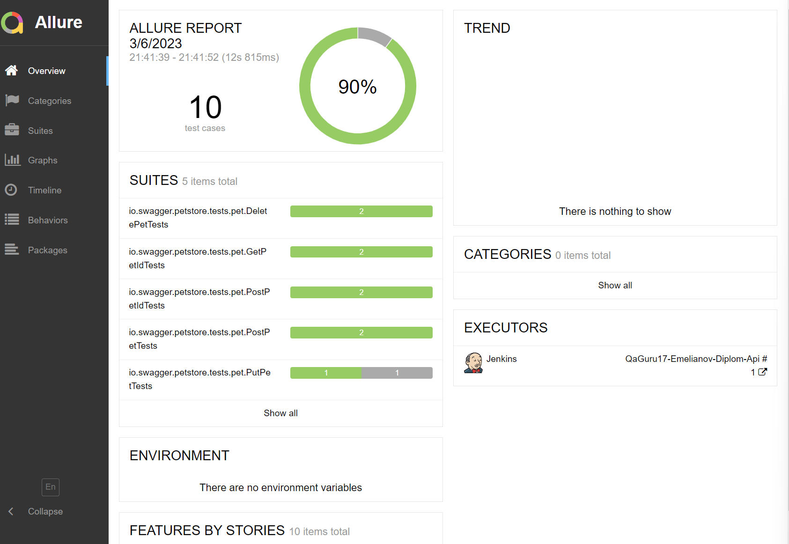
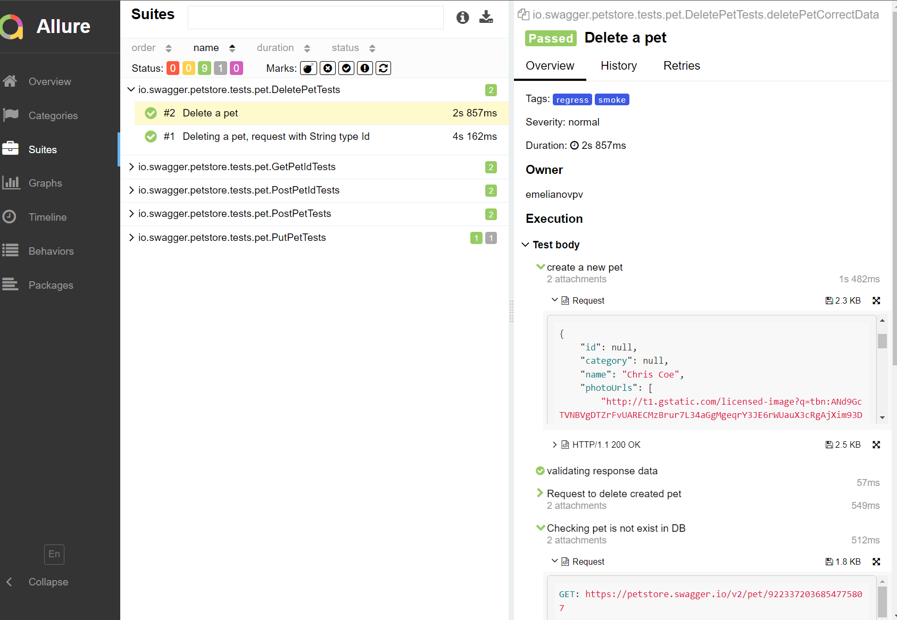
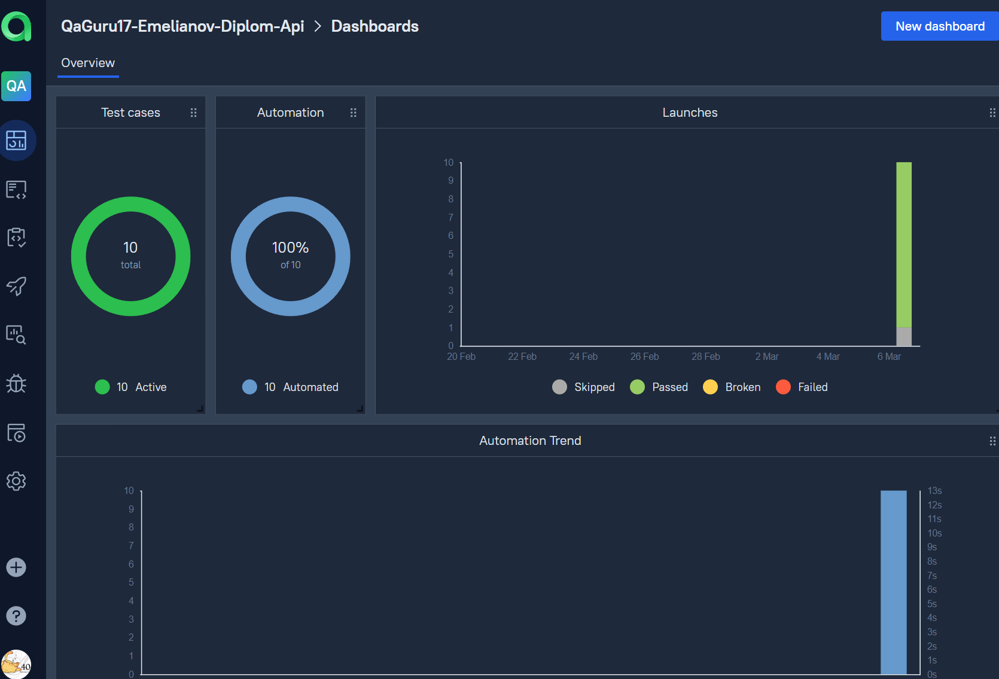
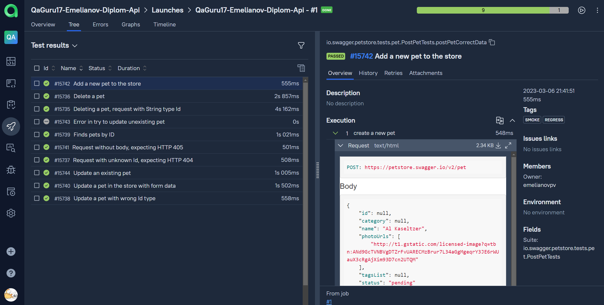
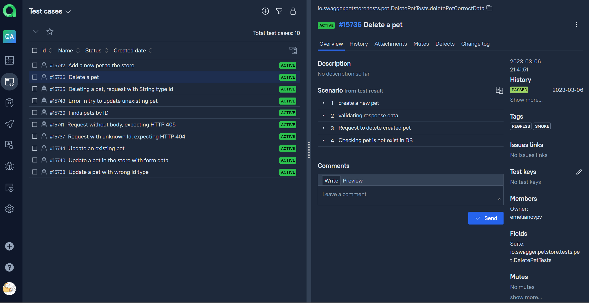
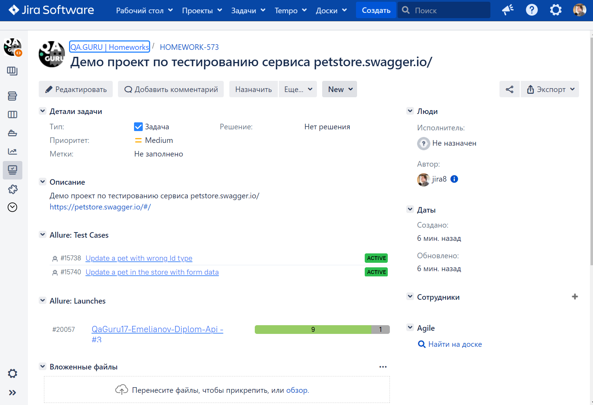
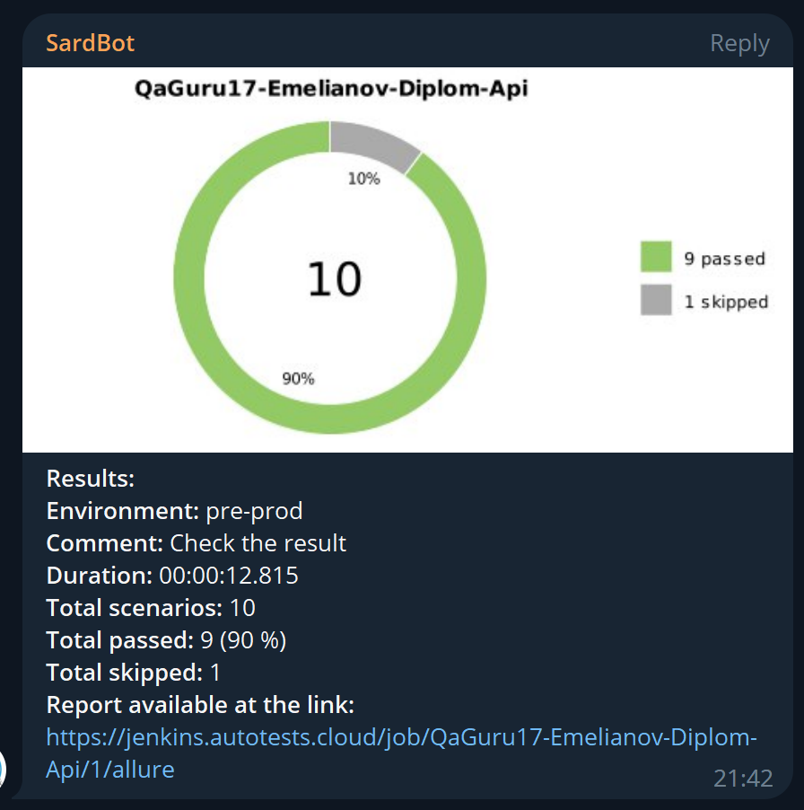

# Проект по автоматизации тестирования сервиса petstore.swagger.io

<br>
<br>

## :pushpin: Содержание:

- [Использованный стек технологий](#computer-использованный-стек-технологий)
- [Реализованные проверки](#computer-реализованные-проверки)
- [Запуск тестов](#running_woman-запуск-тестов)
- [Сборка в Jenkins](#-сборка-в-jenkins)
- [Пример Allure-отчета](#-пример-allure-отчета)
- [Интеграция с Allure TestOps](#-интеграция-с-allure-testops)
- [Уведомления в Telegram с использованием бота](#-уведомления-в-telegram-с-использованием-бота)

## :computer: Использованный стек технологий

<p align="center">


</p>

Автотесты написаны на <code>Java</code> с использованием <code>JUnit 5</code> и <code>Gradle</code>.
Для тестов использована библиотека [REST Assured](https://rest-assured.io/).
Запуск тестов можно осуществлять локально или с помощью Jenkins/Allure TestOps.
Также реализована сборка в <code>Jenkins</code> с формированием Allure-отчета и отправкой уведомления с результатами в <code>Telegram</code> после завершения прогона.

## :computer: Реализованные проверки

- [x] *POST /pet - создание новой учетной записи о животном в магазине*
- [x] *GET /pet/{petId} - получение данных о животном по Id*
- [x] *POST /pet/{petId} - обновление данных о животном (имя/статус)*
- [x] *PUT /pet - обновление данных о животном (все параметры)*
- [x] *DELETE /pet/{petId - удаление данных о животном из базы магазина}*
- [x] *Для каждого метода была сделана одна негативная проверка*

## :running_woman: Запуск тестов

### Локальный запуск тестов
```
gradle clean test
```

При необходимости можно переопределить параметры запуска
```
gradle clean 
test/smoke/regress - запуск всех тестов/только smoke/только regress
```

### Запуск тестов на удаленном браузере из Jenkins/Allure TestOps
```
gradle clean test
```
При необходимости также можно переопределить параметры запуска

```
gradle clean
test/smoke/regress - запуск всех тестов/только smoke/только regress
```

##  <a href="https://jenkins.autotests.cloud/job/QaGuru17-Emelianov-Diplom-Api/">Сборка в Jenkins</a>
<p align="center">

</p>

##  <a href="https://jenkins.autotests.cloud/job/QaGuru17-Emelianov-Diplom-Api/3/allure/">Пример Allure-отчета</a>
### Overview

<p align="center">

</p>

### Результат выполнения теста

<p align="center">

</p>

##  Интеграция с [Allure TestOps](https://qameta.io/)

### Основной дашборд

<p align="center">
  
</p>

### Список тестов с результатами прогона

<p align="center">
  
</p>

### Тест-кейсы

<p align="center">
  
</p>


# Интеграция с Jira
<p align="center">
  
</p>

###  Уведомления в Telegram с использованием бота

После завершения сборки специальный бот, созданный в <code>Telegram</code>, автоматически обрабатывает и отправляет сообщение с отчетом о прогоне.

<p align="center">

</p>
